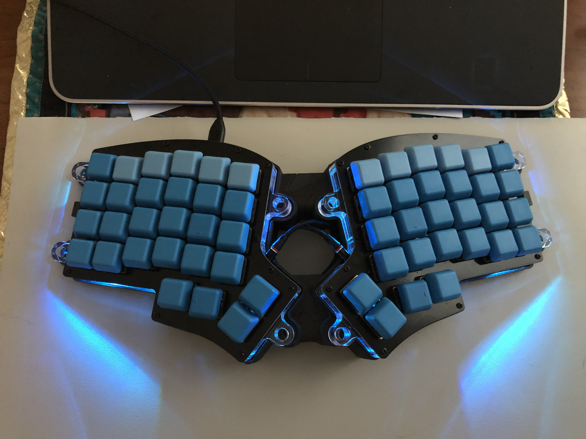
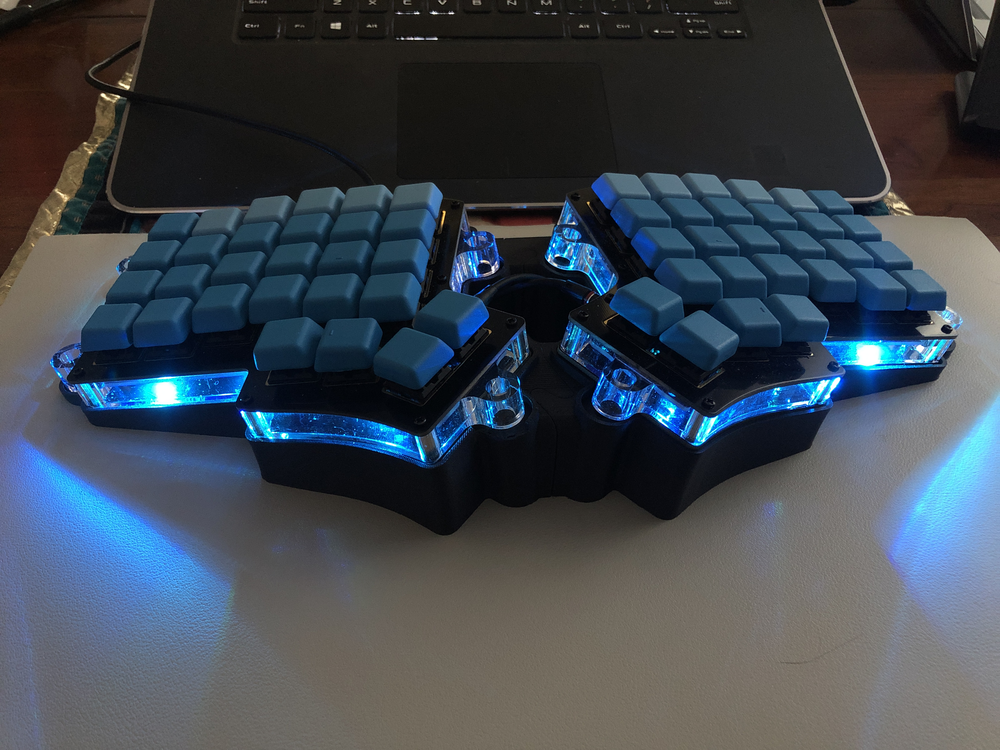
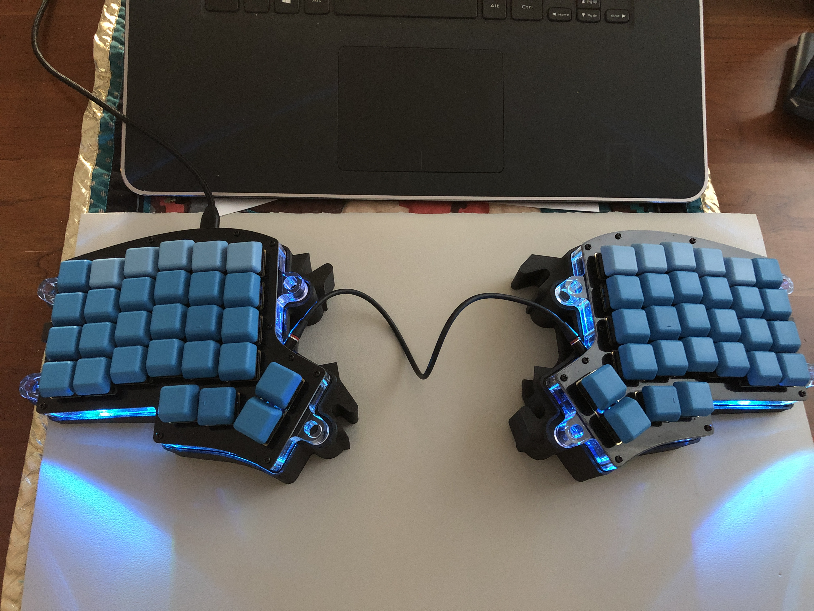
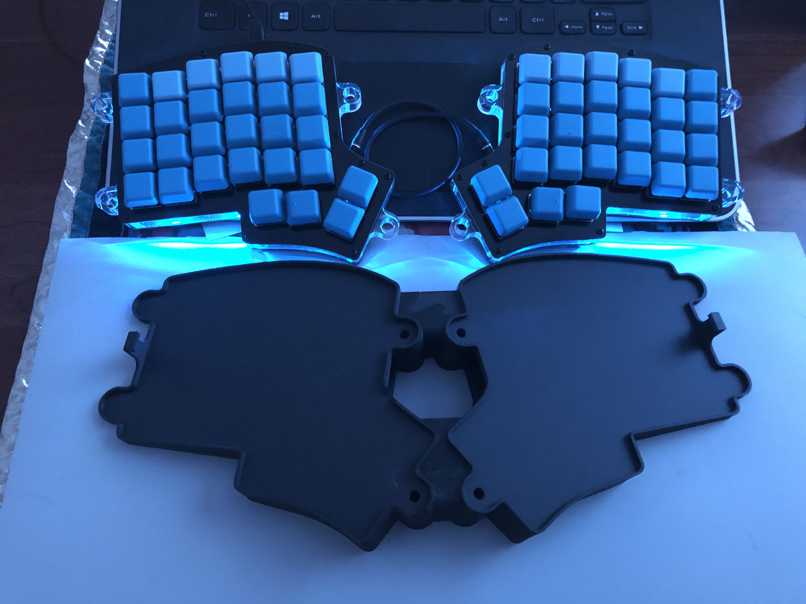
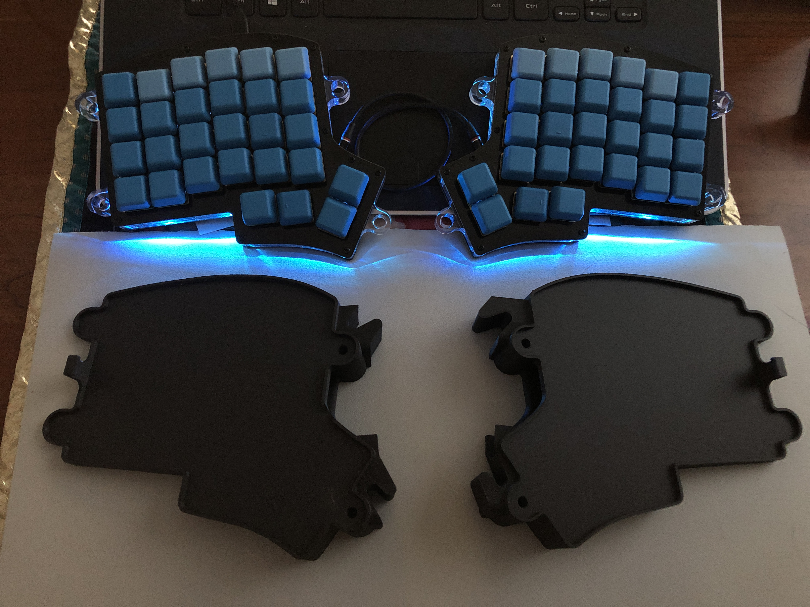

# Keebio Iris Egonomic Keyboard Stand

This is a 3D printed stand for the Iris keyboard (rev 4) from [Keebio](https://keeb.io/)

## Features
- Compatible with Iris Rev 4 keyboard from Keebio (possibly rev 3 also, but not verified).
- Tented to 11 degrees, with 20 degrees of splay when the two sides are locked together, for optimal ergonomics.
- For normal use, tabs and friction hold the keyboard to the stand.
- Tented version of case can be optionally secured with two 1/4" or M6 screws (holes are pre-formed and tapped to size).
- The two halves interlock, but a close slip fit allows for detachability without tools (if you use a decent printer, ~100 micron accuracy).
- An internal cavity provides room for storing one USB and one TRRS cable.

## Media

